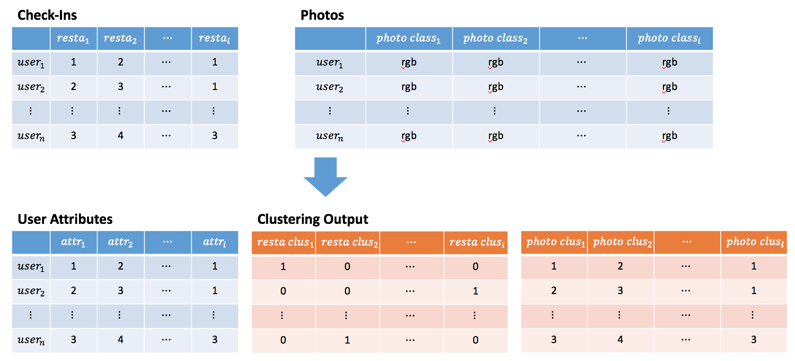

# Community Detection & its Implications in Dining Decisions within Singapore Community

## Section 1: Background
Singapore is a well-known food paradise with a wide varieties of food. Social gatherings over a meal is a common and favorite past times of many in Singapore.[1] In fact, Mastercard has revealed that Singaporeans are the top spenders in dining in the region in 2013. [2]

In Singapore, there are many food guides and restaurants' recommendation sites such as "hungrygowhere.com", "wheretoeat.com.sg", or "sethlui.com" etc that provide information & make recommendations on possible dining venues.[3]

## Section 2: Motivation

One's social network can influence his/her dining choices. In fact, A survey conducted by Angelsmith in 2012 has revealed that ~50% of the survey respondents seek information from their trusted friends for recommendations on dining decisions in USA. [4]

While there is an abundance of information on great food places on this island, most of them are food blogs, sites with paid advertisements, and random reviews.[3] Thus, not much have been done to investigate if dining decisions in Singapore are affected by one's social network. Hence, we can verify the impact of one's social networks in influencing his/her dining decision by detecting the various communities present in Singapore when it comes to dining decisions, and identify the influencers in each of these communities. In this project, we will detect these communities via the Foursquare social network.

<b> Application </b>: From here, we are able to assess the effectiveness of using one's social networks' decision in dining venues, and make relevant dining recommendations to the users. These analysis will be useful to build a recommendation engine on dining decisions in other web/mobile applications.

## Section 3: About the Dataset

We are able to obtain our data from Foursquare.com via its API, as below;

1.
2.
3.
4.
5.

## Section 4: Analysis Approaches

Data retrieved from Foursquare will be transformed into adjancency matrices with each row representing users and columns representing restaurants or photos. The user-restaurant matrix will be constructed based on the # of check-ins a user has at a particular restaurant. Photos will be first classified into cuisines (eg. Indian, Chinese etc), people or others.

Following which, clustering or dimension reduction will be applied to detect communities within, using the above adjacency matrices. The result of the clustering or dimension reduction will then be appended to the user attributes to form the data set to be used for recommendations. A high level representation of the data set is shown below.

This will also help us answer questions such as:
* What kind of photo (food / face / random) does one tend to share of restaurant given one's membership in a community?
* Are the different communities based on photos and restaurants visited?

Using the data set prepared, we will attempt to develop a recommendation engine with the purpose of suggesting restaurants based on community memberships of the users and their attributes. This will be done by leveraging on machine learning algorithms.

Depending on the results, we may further enrich the data set to contain the user's past check-ins in making recommendations.

## Section 5: Evaluation and Comments

Evaluation will be done by comparing the recommendations to the actual check-ins of the users. The precision and recall method will be used as measures for evaluation. We will then comment on the effectiveness of using our methods for a recommendation engine.

## Section 6: Reference
[1] Singapore - The Food Paradise from http://www.discoverabroad.com/singapore/livingabroad/lifeandculture/EatingGuide.htm retrieved on 25 Jun 17.

[2] Singaporeans are top spenders on dining in region: MasterCard from http://www.asiaone.com/business/singaporeans-are-top-spenders-dining-region-mastercard retrieved on 25 Jun 17.

[3] Have You Eaten? from http://www.nuss.org.sg/publication/1452137004_sample.pdf retrieved on 25 Jun 17.

[4] Groundbreaking Survey Reveals How Diners Choose Restaurants from http://angelsmith.net/social-media-marketing/groundbreaking-survey-reveals-how-diners-choose-restaurants/ retrieved on 25 Jun 17

[5] Community Detection in Social Networks through Community Formation Games from https://www.ijcai.org/Proceedings/11/Papers/429.pdf retrieved on 25 Jun 17

[2]
